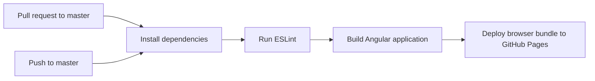

# Angular CI/CD Pipeline Lab

This repository demonstrates a continuous integration and continuous deployment workflow for an Angular application. GitHub Actions installs dependencies, runs ESLint, builds the application, and publishes the static browser bundle to GitHub Pages after changes reach `master`.

## Pipeline



| Event | Result |
| --- | --- |
| Pull request targeting `master` | Lint and production build validate the change. |
| Push to `master` | The same validation runs, then the static browser bundle is deployed to GitHub Pages. |

The workflow lives in [`.github/workflows/deploy.yml`](.github/workflows/deploy.yml). It uses the Angular lockfile in `HelloWorld/` for reproducible installs and publishes `HelloWorld/dist/browser`.

## Local development

```bash
cd HelloWorld
npm ci
npm run lint
npm run build -- --base-href=/pipelines/
npm start
```

The development server is available at `http://localhost:4200/`.

## GitHub Pages setup

In the repository, open **Settings → Pages** and select **GitHub Actions** as the build and deployment source. After a successful push to `master`, GitHub Pages publishes the generated browser bundle at:

```text
https://boupdown.github.io/pipelines/
```

## Stack

- Angular 18 and TypeScript
- ESLint with Angular ESLint
- GitHub Actions
- GitHub Pages

## Notes

`node_modules` and build output are excluded from version control. Install dependencies from `HelloWorld/package-lock.json` instead of committing generated packages.
